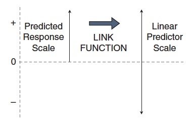
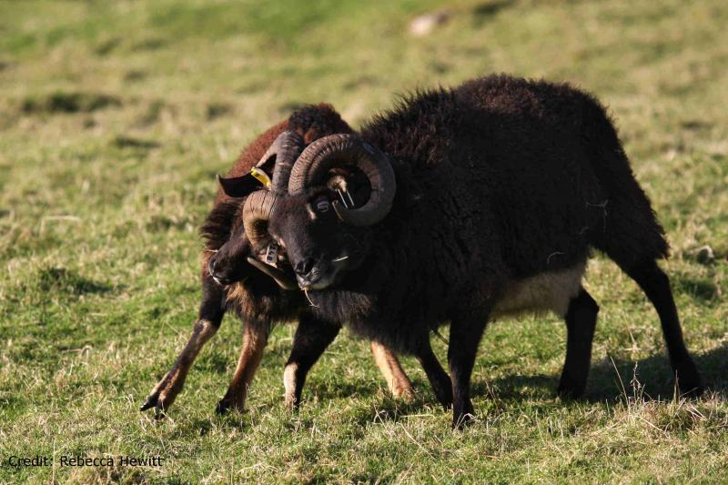

```{r setup2, include=FALSE}
knitr::opts_chunk$set(echo = TRUE)
packages_needed <- c("ggplot2", # graphics
                     "plyr",
                     "arm", # display() etc.
                     "MASS",
                     "ggfortify"
                     )
pk_to_install <- packages_needed [!( packages_needed %in% rownames(installed.packages())  )]
if(length(pk_to_install)>0 ){
  install.packages(pk_to_install,repos="http://cran.r-project.org")
}
#lapply(packages_needed, require, character.only = TRUE)
library(ggplot2)
library(plyr)
library(arm)
library(MASS)
library(ggfortify)
```
Count data resemble binomial count data in taking whole number values, but differ in that we only know how many times an event occurred, not the number of times it did not occur.

The starting point for GLM analysis of count data is using the
**Poisson distribution** and a **log link function**. The log link function (or rather
its inverse) ensures that all predicted counts are positive (we can’t have a
negative count!) by taking the *exponent of the values generated by the linear
predictor*. 



The Poisson distribution defines the variance as equal to the
mean, but as always this assumption needs to be examined since count data
won’t necessarily have this property in all cases.

The Poisson distribution is defined as having a variance equal to its mean.

If X ∼ Po(λ), then

μ = λ

σ = √λ

σ^2 = λ

If this assumption is met the ratio of residual deviance to residual DF (the
dispersion) should be approximately 1:1.

What does a Poisson Distribution look like? It depends a lot on the mean.

```{r Example of Poisson Distributions}
#generate fake poisson distributions using 1000 replicate draws with differing means
set.seed(1234) #so everybodys 'random draws' look the same
data <- data.frame(cond = factor(rep(c("A","B","C","D"), each=1000)), 
                   rating = c(rpois(1000, 0.8),rpois(1000, 1.5),
                              rpois(1000, 5.0), rpois(1000, 12.0)))

#find the mean of each group
means <- ddply(data, "cond", summarise, rating.mean=mean(rating))
means

# Plot histograms with mean lines, using means from above
ggplot(data, aes(x=rating)) + geom_histogram(binwidth=1, colour="black", fill="white") + 
  facet_grid(cond ~ .) +
  scale_x_continuous(breaks=seq(0,30,5)) +
  ggtitle("Poisson Distributions With Differing Means") +
  geom_vline(data=means, aes(xintercept=rating.mean), linetype="dashed", size=1, colour="red")
```
Lets look at and example from the literature: Hautier, Niklaus, and Hector (2009; Science, 324: 636).
https://pdfs.semanticscholar.org/d025/af40f1c74cb4ae9f39e45520160bdc45fa7a.pdf

* Counts of the number of species in experimental grassland plots exposed to fertilization and addition of light to the grassland understorey.

* Fertilization usually increases productivity but leads to a loss of plant diversity.

* One idea is that this is because enhanced growth leads to increasingly asymmetric competition for light (taller plants not only use the light themselves but can reduce its passage to their shorter competitors). 

* The experiment tested this hypothesis by restoring light levels in the grassland understorey: if the idea is correct, this should prevent and reduce loss of species.

```{r Import Data}
Fertilizer_counts <- read.delim("Fertilizer_counts.txt")
View(Fertilizer_counts)
```

```{r Boxplot of Plant Diversity in Experimental Plots}
ggplot(Fertilizer_counts, aes(FL,Diversity)) +
  geom_boxplot() +
  geom_point()
```
```{r Specify the Poisson GLM}
pois1 <- glm(Diversity~Light*Fertilizer, family= poisson(link=log), data= Fertilizer_counts)
```

```{r summary pois1}
summary(pois1)
```
Count data are often overdispersed where the residual deviance is more than expected, but in this case it is around a third less than expected (underdispersion).

Minor levels of underdispersion are often ignored, but here we could again use *quasi-maximum* likelihood to take it into account by estimating the observed level of variation and adjusting the standard errors accordingly. (note: notice how the standard errors are recalculated [but coefficients are not], but that also changes the calculated test statistic, z or t, [which is ratio of estimate to error] and the P-value)
```{r Quasi-poisson to fix the underdispersion}
qpois1 <- glm(Diversity~Light*Fertilizer, quasipoisson, data= Fertilizer_counts)
summary(qpois1)
coef(qpois1)
```
```{r}
confint(qpois1)
```
Interpretation (remember that coefficients are still on the log scale):

As usual we start at the bottom of the table with the interaction. The
interaction is significant so we have our main result; the significance of the
other rows is of limited interest (they give thexp(e average effects and the interaction
tells us that average effects can be misleading because the effects of
the factors depend on each other).

On average, fertilizer leads to a loss of species but when light is added to the understorey this effect is cancelled out (adding light has a positive effect here, although this effect was not significant in the original analysis of changes in species richness which had the advantage of controlling for initial variation in diversity between plots which our analysis here does not do). 

The interaction.plot() function provides a quick option for examining interactions:
```{r Interaction Plot}
attach(Fertilizer_counts)
interaction.plot(Fertilizer, Light, Diversity)
detach(Fertilizer_counts)
```
While the data here are integer counts the Poisson distribution does not provide
a very good model for the variation, which is less than expected (count
data often have more low values and include zeros). More often, Poisson
GLMs are overdispersed (quasi-Poisson models are an option for taking the
overdispersion into account). 

It is possible that the Poisson distribution may be close to normally distributed here so we could try a Gaussian GLM (although it could predict negative counts which are impossible with the Poisson model). 

The boxcox() function can guide us on transformations:

```{r boxcox transform}
boxcox(glm(Diversity~Light*Fertilizer, data = Fertilizer_counts))
```
The CI is quite wide and includes no action (λ = 1) but the ‘best’ transformation
(although remember that the sole criterion is linearizing the relationship)
is the log (λ = 0):

```{r log normal model}
log.norm <- glm(Diversity~Light*Fertilizer, gaussian (link=log), data= Fertilizer_counts)
```
If you extract the coefficients you will find that, perhaps not surprisingly
(the only difference is the variance function), the estimated coefficients are
very similar to the quasi-Poisson GLM (not shown), confirming that a
Gaussian GLM (or a normal least squares analysis of the log-transformed
data) produces essentially the same result.

```{r}
summary(log.norm)
coef(log.norm)
```

**Summary of GLM Counts**

* A GLM with a Poisson distribution is a good place to start when dealing
with integer count data. 

* The default log link function prevents the prediction of negative counts and with the Poisson distribution we assume that the variance is approximately equal to the mean.

* Overdispersion can be diagnosed and dealt with in a way similar to the analysis of binomial count data. However, just because data are integer counts does not mean the Poisson distribution will necessarily be a good model. The Poisson distribution generally applies well to data with many low values, including zeros.

* In this example there was less variation than expected due to an absence of these low values and we found *underdispersion*. When there are few low values and zeros, and the mean count rises, the Poisson distribution becomes similar to the normal distribution, as we observed for this example.


**Another Example**

Fat Sheep Fitness (Soay Sheep): Sexual selection for increased body size relates to fitness.

```{r}
sheepfitness <- read.csv("sheepfitness.csv")
sheep.glm <- glm(fitness ~ body.size, data = sheepfitness, family = poisson)
```
As a reminder, what link function did the model use in specifying the GLM? What is the 'canonical' link for the Poisson family?
```{r}
sheep.glm <- glm(fitness ~ body.size, data = sheepfitness, family = poisson(link = log))
#this is the same model as above, but all defaults are reported rather than assumed
```
Lets look at the diagnostic plots.
```{r diagnose sheep glm model, fig.width=6, fig.height=6}
autoplot(sheep.glm)
```
* The plot of residuals vs fitted values (upper left panel) suggests that
the systematic part of the model is now pretty good. There is no clear
pattern in the relationship, apart from the very slight upward trend at
the end. This is nowhere close to being large enough to worry about—
it’s driven entirely by only two points on the very right.

* The normal Q–Q plot (upper right panel) is also much better. It
isn’t perfect, as there is some departure from the dashed line, but we
shouldn’t expect a perfect plot. Life is never perfect. It is a lot better
than the corresponding the plot from the lm() model, so it looks like
our distributional assumptions are OK.

* The scale–location plot (bottom left panel) seems to show a slight
positive relationship between the size of the residuals and the fitted
values. If you just focus on the points, there isn’t much going on.

* The residuals–leverage plot (bottom right panel) is also fine. There is
no evidence that we have to worry about outliers or points having too
much of an effect on the model.
\
\
Wait, wait, wait.......
How come the Q-Q plot tells us the data are 'normal', even though we are using a Poisson error structure?

When R builds diagnostics for a GLM, it uses something called the **standardized deviance residuals**. Again, these sound a lot more fancy than they really are. They are a specially transformed version of the raw residuals that make the transformed residuals normally distributed, if (and only if) the GLM family we’re using is appropriate.

What this means is, if the chosen family is a good choice for our data, then our diagnostics should behave like those from a model with normally distributed errors. The ‘normal Q–Q plot’ for the transformed residuals is checking whether the Poisson distribution is appropriate for the distribution of the residuals, and the scale–location plot is checking whether the mean–variance relationship is OK (it will only be patternless if the Poisson distribution is the right model).

```{r Look at the model}
anova(sheep.glm)
```
Because the model is fit with maximum likelihood, we get deviance table. Deviance explained by body size is 37.0 units, unaccounted deviance is 48.0 and the total deviance (body size + unaccounted) is 85.0.
```{r}
summary(sheep.glm)
```
What does the report tell us?

* coefficient tests: **Wald z-value** to tell us whether the estimate is significantly different from zero. Ratio of the estimate/SE (for body size 0.540/0.093 = 5.80).

* The model looks fine for over dispersion (48.0/48.0=1).

* AIC: to be used in comparing 'fits' of different nested models (more on this later).

* **We transform the coefficient to make a prediction**; remember that the GLM is predicting the natural logarithm of lifetime reproductive success. If we want to know how many lambs a 5 kg ewe is predicted to produce, we must account for what the link function did.


What is the expected limetime fitness for a 5 kg sheep? ANSWER=e^(-2.422+0.541*5), or 1.33 lambs.

```{r Exponentiate the prediction}
exp(-2.422+0.541*5)
```


```{r}
ggplot(sheepfitness, aes(x = body.size, y = fitness)) +
geom_point() +
geom_smooth(method = "glm", method.args=list(family="gaussian"(link="identity")))+
#geom_smooth(span = 1, colour = "red", se = FALSE) +
xlab("Body mass (kg)") + ylab("Lifetime fitness (No. of Lambs)") +
  ggtitle("Linear Model = Gaussian Error Structure, Identity Link")
#note negative prediction of fitness below ~3kg.

ggplot(sheepfitness, aes(x = body.size, y = fitness)) +
geom_point() +
geom_smooth(method="glm", method.args=list(family="poisson"(link="log"))) +
xlab("Body mass (kg)") + ylab("Lifetime fitness (No. of Lambs)") +
  ggtitle("Linear Model = Poisson Error Structure, Log Link")
```

