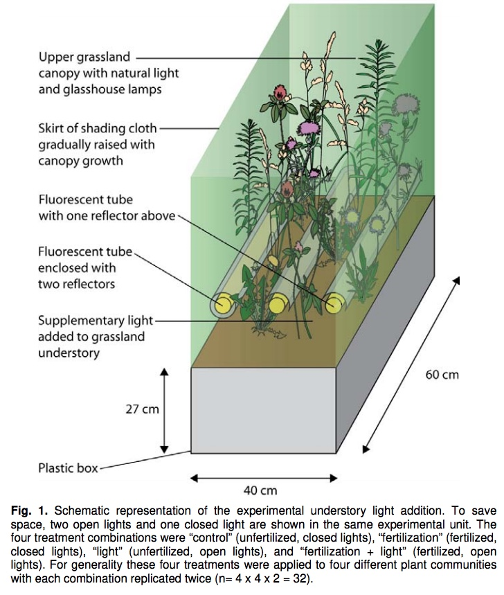

```{r setup, include=FALSE}
knitr::opts_chunk$set(echo = TRUE)
packages_needed <- c("ggplot2", # graphics
                     "plyr",
                     "arm", # display() etc.
                     "MASS",
                     "dplyr",
                     "ggfortify",
                     "easystats"
                     )
pk_to_install <- packages_needed [!( packages_needed %in% rownames(installed.packages())  )]
if(length(pk_to_install)>0 ){
  install.packages(pk_to_install,repos="http://cran.r-project.org")
}
#lapply(packages_needed, require, character.only = TRUE)
library(ggplot2)
library(plyr)
library(arm)
library(MASS)
library(dplyr)
library(ggfortify)
library(easystats)
```

Good background video:

https://www.youtube.com/watch?v=i62gffPrZYA


Count data resemble binomial count data in taking whole number values,
but differ in that we only know how many times an event occurred, not
the number of times it did not occur.

The starting point for GLM analysis of count data is using the **Poisson
distribution** and a **log link function**. The log link function (or
rather its inverse) ensures that all predicted counts are positive (we
can't have a negative count!) by taking the *exponent of the values
generated by the linear predictor*.


The Poisson distribution defines the variance as equal to the mean, but
as always this assumption needs to be examined since count data won't
necessarily have this property in all cases.

The Poisson distribution has only one parameter, called λ.

-   The mean of a Poisson distribution is λ.

-   The variance of a Poisson distribution is also λ.

In most distributions, the mean is represented by µ (mu) and the
variance is represented by σ² (sigma squared). Because these two
parameters are the same in a Poisson distribution, we use the λ symbol
to represent both.

If X ∼ Po(λ), then

μ = λ

σ = √λ

σ² = λ

**If this assumption is met the ratio of residual deviance to residual
DF (the dispersion) should be approximately 1:1.**

What does a Poisson Distribution look like? It depends a lot on the
mean. As λ increases, the distribution looks more and more similar to a
normal distribution. In fact, when λ is 10 or greater, a normal
distribution is a good approximation of the Poisson distribution.

```{r example of Poisson distributions}
#generate fake poisson distributions using 1000 replicate draws with differing means
set.seed(1234) #so everybodys 'random draws' look the same
data <- data.frame(cond = factor(rep(c("A","B","C","D"), each=1000)), 
                   rating = c(rpois(1000, 0.8),
                              rpois(1000, 1.5),
                              rpois(1000, 5.0), 
                              rpois(1000, 12.0)))

#find the mean of each group
means <- data %>%
  group_by(cond) %>%
  summarize(mean_rating = mean(rating, na.rm=TRUE))
means

# Plot histograms with mean lines, using means from above
ggplot(data, aes(x=rating)) + geom_histogram(binwidth=1, colour="black", fill="white") + 
  facet_grid(cond ~ .) +
  scale_x_continuous(breaks=seq(0,30,5)) +
  ggtitle("Poisson Distributions With Differing Means") +
  geom_vline(data=means, aes(xintercept=mean_rating), linetype="dashed", linewidth=1, colour="red")
```

\
\


**Example from Crawley (2007). The R Book.**

Straightforward linear regression methods (assuming constant variance, normal errors)
are not appropriate for count data for four main reasons:

* The linear model might lead to the prediction of negative counts.
* The variance of the response variable is likely to increase with the mean.
* The errors will not be normally distributed.
* Zeros are difficult to handle in transformations.

In R, count data are handled very elegantly in a generalized linear model by specifying
family=poisson which sets errors = Poisson and link = log (see p. 515). The log link
ensures that all the fitted values are positive, while the Poisson errors take account of the
fact that the data are integer and have variances that are equal to their means.

```{r import data}
clusters <- read.csv("../data/clusters.csv")
```

Does the incidence of cancer (number of cases) increase with distance to a nuclear reactor?

```{r plot the data, message=FALSE, warning=FALSE}
ggplot(clusters, aes(distance, cancers)) + 
  geom_point(size=3, pch = 21) +
  geom_smooth(method="glm", method.args=list(family="poisson"(link="log"))) +
  ylab("Number of Cancers Detected") +
  xlab("Distance to Reactor (km)") +
  labs(caption = "Look at all those zeros!")
```

```{r histogram of cancer clusters, message=FALSE, warning=FALSE}
ggplot(data=clusters, aes(cancers)) + 
  geom_histogram() +
  labs(title = "Look at all those zeros!")
```


```{r poisson model}
model_cancer_poisson <- glm(cancers ~ distance, family = poisson, data=clusters)
summary(model_cancer_poisson)
```
The trend does not look to be significant, but **look at the residual deviance**. It is assumed that this is the same as the residual degrees of freedom. The fact that residual deviance is larger than residual df indicates that we likely have overdispersion.

```{r check the poisson model, fig.width=8, fig.height=6, message=FALSE, warning=FALSE}
check_model(model_cancer_poisson)
```

We can compensate for the overdispersion by refining the model using quasi-Poisson rather than Poisson errors.

```{r quasi-Poisson model}
model_cancer_quasi <- glm(cancers~distance, family = quasipoisson, data = clusters)
summary(model_cancer_quasi)
```
Compensating for the overdispersion (using quasipoisson) increased to P-value from 0.094 to 0.183, so there is no compelling evidence to support the idea that cancer incidence is related to distance from the reactor. Therefore it doesn't make much sense to try to interpret the distance slope coefficient.

```{r check the quasi-poisson model, fig.width=11, message=FALSE, warning=FALSE}
check_model(model_cancer_quasi)
```
\
Quasipoisson fit looks the same as the Poisson model; not much else we can do.
\
\
\
**Lets look at and example from the literature: Hautier, Niklaus, and
Hector (2009; Science, 324: 636).**
<https://www.zora.uzh.ch/id/eprint/18666/2/Hautier_2009.pdf>

-   Counts of the number of species in experimental grassland plots
    exposed to fertilization and addition of light to the grassland
    understory.

-   Fertilization usually increases productivity but leads to a loss of
    plant diversity.

-   One idea is that this is because enhanced growth leads to
    increasingly asymmetric competition for light (taller plants not
    only use the light themselves but can reduce its passage to their
    shorter competitors).

-   The experiment tested this hypothesis by restoring light levels in
    the grassland understory: if the idea is correct, this should
    prevent and reduce loss of species.



```{r import fertilizer data}
Fertilizer_counts <- read.csv("../data/fertilizer_counts.csv")
#View(Fertilizer_counts)
```

```{r boxplot of plant diversity in experimental plots}
ggplot(Fertilizer_counts, aes(FL,Diversity)) +
  geom_boxplot() +
  geom_jitter(shape=1, size=3, height = 0, width = .15) #because count data overlap a lot when duplicate values are present
```

```{r histogram of diversity, message=FALSE, warning=FALSE}
ggplot(data=Fertilizer_counts, aes(Diversity)) + 
  geom_histogram() +
  labs(title = "No zeros: Makes sense, zero would mean no grassland species present. \nLooks almost more like a normal dist. than poisson")
```

```{r Specify the Poisson GLM}
pois1 <- glm(Diversity~Light*Fertilizer, family= poisson(link=log), data= Fertilizer_counts)
```

```{r summary pois1}
summary(pois1)
```

```{r plot pois1 model parameters, fig.height=2.5}
#easystats package
plot(parameters(pois1)) +
  ggplot2::labs(title = "Plot model coefficients to visualize\n (some C.I.s overlap zero)")
```

Count data are often overdispersed where the residual deviance is more
than expected, but in this case it is much less than expected
(underdispersion: Residual deviance: 6.6221 on 28 degrees of freedom).

Minor levels of underdispersion are often ignored, but here we could
again use *quasi-maximum* likelihood to take it into account by
estimating the observed level of variation and adjusting the standard
errors accordingly. (note: notice how the standard errors are
recalculated [but coefficients are not], but that also changes the
calculated test statistic, z or t, [which is ratio of estimate to error]
and the P-value)

```{r Quasi-poisson to fix the underdispersion}
qpois1 <- glm(Diversity~Light*Fertilizer, quasipoisson, data= Fertilizer_counts)
summary(qpois1)
```

```{r coef of qposi1}
kableExtra::kable(round(coef(qpois1), 3), caption = "Poisson Regression Coefficients")
```

```{r confit of qposi1}
confint(qpois1)
```
```{r plot qpois1 model parameters, fig.height=2.5}
#easystats package
plot(parameters(qpois1)) +
  ggplot2::labs(title = "Plot model coefficients to visualize quasipoisson")
```
\
\
Interpretation (remember that coefficients are still on the log scale):

As usual we start at the bottom of the table with the interaction. The
interaction is significant so we have our main result; the significance
of the other rows is of limited interest (they give the average effects
and the interaction tells us that average effects can be misleading
because the effects of the factors depend on each other).

On average, fertilizer leads to a loss of species but when light is
added to the understorey this effect is cancelled out (adding light has
a positive effect here, although this effect was not significant in the
original analysis of changes in species richness which had the advantage
of controlling for initial variation in diversity between plots which
our analysis here does not do).

The `interaction.plot()` function provides a quick option for examining
interactions:

```{r Interaction Plot}
attach(Fertilizer_counts)
interaction.plot(Fertilizer, Light, Diversity)
detach(Fertilizer_counts)
```

While the data here are integer counts, the Poisson distribution does not
provide a very good model for the variation, which is less than expected
(count data often have more low values and include zeros). More often,
Poisson GLMs are overdispersed (quasi-Poisson models are an option for
taking the overdispersion into account).

It is possible that the Poisson distribution may be close to normally
distributed here so we could try a Gaussian GLM (although it could
predict negative counts which are impossible with the Poisson model).

The `boxcox()` function can guide us on transformations:

```{r boxcox transform}
boxcox(glm(Diversity~Light*Fertilizer, data = Fertilizer_counts))
```

The CI is quite wide and includes no action (λ = 1), but the 'best'
transformation is the log (λ = 0):

```{r log normal model}
log.norm <- glm(Diversity~Light*Fertilizer, gaussian (link=log), data= Fertilizer_counts)
```

If you extract the coefficients you will find that, perhaps not
surprisingly (the only difference is the variance function), the
estimated coefficients are very similar to the quasi-Poisson GLM (not
shown), confirming that a Gaussian GLM (or a normal least squares
analysis of the log-transformed data) produces essentially the same
result.

```{r summary of log.norm model}
summary(log.norm)
coef(log.norm)
```
\
\
**Another Example: Soay Sheep**

Fat Sheep Fitness (Soay Sheep): Sexual selection for increased body size
relates to fitness. 

```{r import sheep fitness data}
sheepfitness <- read.csv("../data/sheepfitness.csv")
sheep.poisson <- glm(fitness ~ body.size, data = sheepfitness, family = poisson)
```

```{r compare poisson vs gaussian plots of sheep fitness, message=FALSE, warning=FALSE}
ggplot(sheepfitness, aes(x = body.size, y = fitness)) +
geom_point() +
geom_smooth(method = "glm", method.args=list(family="gaussian"(link="identity")))+
#geom_smooth(span = 1, colour = "red", se = FALSE) +
xlab("Body mass (kg)") + ylab("Lifetime fitness (No. of Lambs)") +
  ggtitle("Linear Model = Gaussian Error Structure, Identity Link")
#note negative prediction of fitness below ~3kg.

ggplot(sheepfitness, aes(x = body.size, y = fitness)) +
geom_point() +
geom_smooth(method="glm", method.args=list(family="poisson"(link="log"))) +
xlab("Body mass (kg)") + ylab("Lifetime fitness (No. of Lambs)") +
  ggtitle("Linear Model = Poisson Error Structure, Log Link")
```

As a reminder, what link function did the model use in specifying the
GLM? What is the 'canonical' link for the Poisson family?

```{r sheep.poisson model}
sheep.poisson <- glm(fitness ~ body.size, data = sheepfitness, family = poisson(link = log))
#this is the same model as above, but all defaults are explicitly reported rather than assumed
```

Lets look at the diagnostic plots.

```{r diagnose sheep glm model, fig.height=6, fig.width=8, message=FALSE, warning=FALSE}
check_model(sheep.poisson)
```

-   The **plot of residuals vs fitted values** (upper left panel)
    suggests that the systematic part of the model is now pretty good.
    There is no clear pattern in the relationship, apart from the very
    slight upward trend at the end. This is nowhere close to being large
    enough to worry about--- it's driven entirely by only two points on
    the very right.

-   The **normal Q--Q plot** (upper right panel) is also much better. It
    isn't perfect, as there is some departure from the dashed line, but
    we shouldn't expect a perfect plot. Life is never perfect. It is a
    lot better than the corresponding the plot from the `lm()` model, so
    it looks like our distributional assumptions are OK.

-   The **scale--location plot** (bottom left panel) seems to show a
    slight positive relationship between the size of the residuals and
    the fitted values. If you just focus on the points, there isn't much
    going on.

-   The **residuals--leverage plot** (bottom right panel) is also fine.
    There is no evidence that we have to worry about outliers or points
    having too much of an effect on the model.\
    \
    Wait, wait, wait....... How come the Q-Q plot tells us the data are
    'normal', even though we are using a Poisson error structure?

When R builds diagnostics for a GLM, it uses something called the
**standardized deviance residuals**. Again, these sound a lot more fancy
than they really are. They are a specially transformed version of the
raw residuals that make the transformed residuals normally distributed,
if (and only if) the GLM family we're using is appropriate.

What this means is, if the chosen family is a good choice for our data,
then our diagnostics should behave like those from a model with normally
distributed errors. The 'normal Q--Q plot' for the transformed residuals
is checking whether the Poisson distribution is appropriate for the
distribution of the residuals, and the scale--location plot is checking
whether the mean--variance relationship is OK (it will only be
patternless if the Poisson distribution is the right model).

```{r Look at the model}
anova(sheep.poisson)
```

Because the model is fit with maximum likelihood, we get deviance table.
Deviance explained by body size is 37.0 units, unaccounted deviance is
48.0 and the total deviance (body size + unaccounted) is 85.0.

```{r summary of sheep.poisson}
summary(sheep.poisson)
```

What does the report tell us?

-   coefficient tests: **Wald z-value** to tell us whether the estimate
    is significantly different from zero. Ratio of the estimate/SE for
    body size is 0.540/0.093 = 5.80.

-   The model looks fine for over dispersion (48.0/48.0=1).

-   AIC: to be used in comparing 'fits' of different nested models (more
    on this later).

-   **We transform the coefficient to make a prediction**; remember that
    the GLM is predicting the natural logarithm of lifetime reproductive
    success. If we want to know how many lambs a 5 kg ewe is predicted
    to produce, we must account for what the link function did.

\

We can use our coefficients to interpret the slope and make predictions from our Poisson GLM.

**Slope (\(\beta_1\))** The slope represents the change in the **log of expected counts** for a one-unit increase in \(X\).

On the response scale, you **exponentiate the slope**:

$$
e^{\beta_1}
$$

This gives the **multiplicative effect** of a one-unit increase in \(X\) on the expected count.

For example, if \(\beta_1 = 0.25\):

$$
e^{0.25} = 1.28
$$

This means each 1-unit increase in \(X\) increases the expected count by 28%.

\

*For our sheep,* if \(\beta_1 = 0.54\):

$$
e^{0.54} = 1.72
$$

This means each 1-unit increase in 𝑋 increases the expected count by 72%.

<p style="color: blue;"> What is the expected limetime fitness for a 5 kg sheep? </p>
ANSWER=e\^(-2.422+0.541\*5), or 1.33 lambs.

```{r Exponentiate the prediction}
exp(-2.422+0.541*5)
```

```{r plot sheep fitness against body size, message=FALSE, warning=FALSE, fig.width=5, fig.height=5, fig.align = 'center'}
ggplot(sheepfitness, aes(body.size, fitness)) +
  geom_point(size=3) +
  geom_smooth (method=lm, color="red") + #if you wanted to see the gaussian/identity fit
  stat_smooth(method = glm, method.args = list(family = poisson(link = "log"))) +
  labs(title="GLM: Count data") +
  xlab ("Body Size (kg)") +
  ylab ("Fitness (Number of Lambs)")
```

Is there a formal way to directly compare poisson and gaussian models? Some people (purists) say no, but I think there is a hack you can use to compare model fits. But remember, poisson was definitely the better model because it avoids prediction of values below zero and 'bends' to fit data.

```{r model comparison, message=FALSE, warning=FALSE}
#first fit gaussian GLM
sheep.gaussian <- glm(fitness ~ body.size, data = sheepfitness, family = gaussian)
#compare poisson vs gaussian models.
compare_performance(sheep.poisson, sheep.gaussian, metrics = "common", verbose = FALSE)
```
Clearly the Poisson model is better on both a prediction and 'fit' basis than the Gaussian model (Lower AICc score). We will talk about different criteria for comparing models in the chapter covering model selection.
\
\
**Summary of GLM Counts**

-   A GLM with a Poisson distribution is a good place to start when
    dealing with integer count data.

-   The default log link function prevents the prediction of negative
    counts and with the Poisson distribution we assume that the variance
    is approximately equal to the mean.

-   Overdispersion can be diagnosed and dealt with in a way similar to
    the analysis of binomial count data. However, just because data are
    integer counts does not mean the Poisson distribution will
    necessarily be a good model. The Poisson distribution generally
    applies well to data with many low values, including zeros.

-   In the fertilizer example there was less variation than expected due to an
    absence of low values and we found *underdispersion*. When
    there are few low values and zeros, and the mean count rises, the
    Poisson distribution becomes similar to the normal distribution, as
    we observed for this example.
    
-   The slope in a poisson model is the change in the **log of expected counts for a one-unit increase in 𝑋**. To make sense of the slope coefficient we must exponentiate it. (exponentiation is the inverse of log; our back transform) We can use exponentiation to make predictions based on the model coefficients in the usual GLM way.
